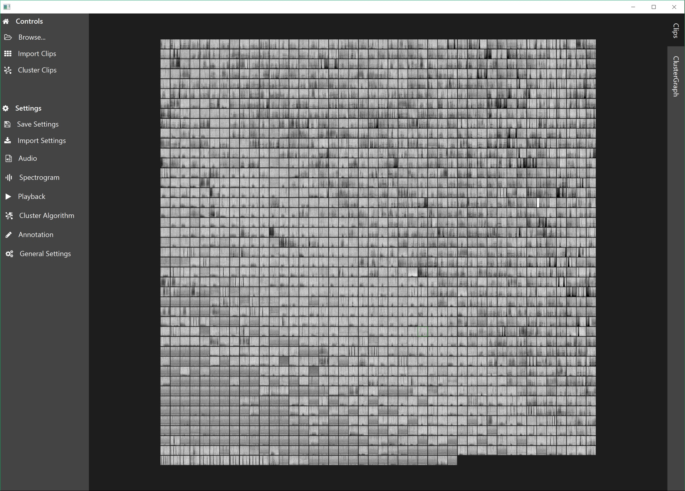

# AIPAM

A Java and JavaFX based program to visualise and cluster sound clips which can then be annotated and export by manual annotation. 

# Introduction #

In passive acoustic monitoring it is often easy to make a <b>detector</b>, i.e. some algorithm which picks out all or a subset of interesting sounds. However making a <b>classifier</b> which accurately picks out a very particular subset of sound types is often difficult, due to variations within species, different noise conditions etc. Machine learning is helping in this area however
humans remain the best pattern recognition machines, we have initiative and can deal with unexpected constancies in datasets. 

AIPAM (working name) is inpsired from a [google experiment](https://experiments.withgoogle.com/bird-sounds) which demonstrated that bird sounds could be clustered very effectively using t-SNE . AIPAM can import a set of clips and perform t-SNE analysis, providing the user with a highly interactive and intuitive UI to visualise and annotate the results. It is designed to be used in a situation where there are lots of possible detections and provides an efficient data visualisation system for a human to then explore and manually annotate a dataset. The clips can be clustered using the Barnes-Hut implementation of the t-SNE algorithm which organises clips and allows more rapid exploration and annotation of the dataset. They can then be exported to be used in further analysis and/or used in the training of more automated machine learning classifiers. 

<center></center>
An example of the program displaying a few thousand clips. 

# Features #

Decimator with anti alisaing filter to down sample clips

Zoom and pannable display of clip spectrograms with options for FFT Length/ FFT Hop, colour maps and colour scales. 

Implementation of t-SNE combined with cost matrix solver to cluster clips and display in grid. 

Simple annotation system for manually identifying clips and exporting.

Settings export and import. 

# Still to do #

Only supports .wav clips. This could be expanded to mp3, aiff etc.

Additional plugins to measure clip metrics on export e.g. power spectrum, peak frequency etc.

The assignment problem is solved using a shortest path algorithm for which the processing time scales with N^3logN. A [Jonker Volgenant algorithm](https://blog.sourced.tech/post/lapjv/) has the potential to be much faster but none of the Java implementations appear to as fast as would be expect (10 hours for 3000 clips) and much slower than shortest path. 


# Installation #

AIPAM is based on JavaFX and requires the Java vitual machine to run.

The program allows the viewing of thousands / gigabytes of clips, however this requires several virtual machine arguments to ensure 
the program Java and JavaFX can be allocated sufficient memory.

```
  -Xmx4098m
  -Dprism.maxvram=2000m
  
```

A good graphics card is recommended. 

A windows installer will be available in the installer folder soon...

# Libraries #

There are multiple libraries used in AIPAM without which a program like this would simply not be feasible to build. 

A fast and native Java [implementation of the t-SNE algorithm](https://github.com/lejon/T-SNE-Java). 

[JavaFX](https://openjfx.io/) an impressive modern UI framework, perfect for an application like this which shows large number of images and requires a user friendly, modern design. 

The excellent [controlsfx](http://fxexperience.com/controlsfx/) library for extra JavaFX bits and pieces. 

[JMetro](https://github.com/JFXtras/jfxtras-styles) for styling the app with fluent design theme. 

[FontawesomeFX](http://www.jensd.de/) for icons. 

[javafxsvg](https://github.com/codecentric/javafxsvg) for reading svg files. 

[Apache Commons Math 3](http://commons.apache.org/proper/commons-math/) for the fast fourier transform and plenty of other useful functions

[iirj](https://github.com/berndporr/iirj) for filtering acoustic data before decimating. 

[alg4](https://github.com/kevin-wayne/algs4) for the solving the assignment problem, i.e. taking clustered points from t-SNE and assigning them to a grid. 

[MatFileRW](https://github.com/diffplug/matfilerw) for writing and reading .mat files. This allows integration of the Java code with MATLAB/Octave.
